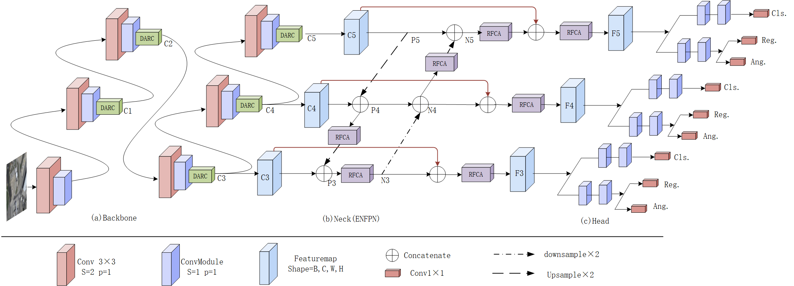
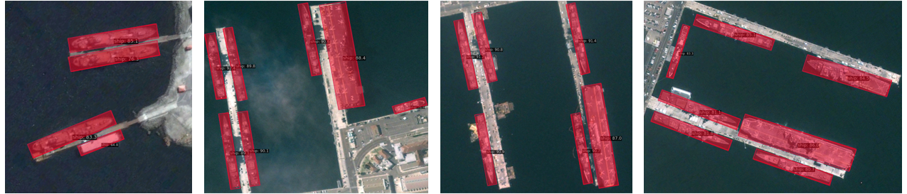
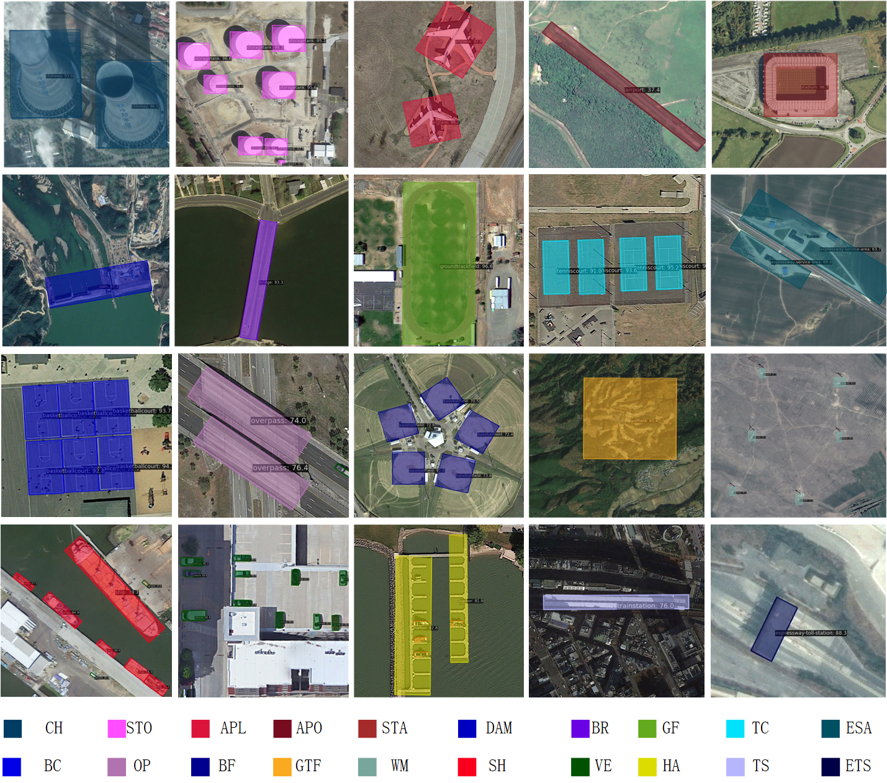

<div align="center">


</div>

## Introduction
[](https://zenodo.org/doi/10.5281/zenodo.11522963)
PGLRNet: Target Pose-Guided and Feature Loss-Reduced Network for Oriented Object Detection in Remote Sensing Images


<div align="center">

  

</div>

The master branch works with **PyTorch 1.10.1**.

## Data Preparation

Please refer to [data_preparation.md](tools/data/README.md) to prepare the data.

## Results and Models

Coco pre-trained PGLRNet backbone: [Download](https://pan.baidu.com/s/1TON5VEafVVpvzDxrEXBDvQ?pwd=iq75)

|  Model  |  mAP  | Angle | lr schd | Batch Size |                                                                                            Download                                                                                            |
|:-------:|:-----:| :---: |:-------:|:----------:|:----------------------------------------------------------------------------------------------------------------------------------------------------------------------------------------------:|
| PGLRNet | 82.24 | le90  |   3x    |    1\*2    |                            [model](https://pan.baidu.com/s/1P6FkFiW1Eiy-Q-OGK_so3w?pwd=4z1u)                            |

## Installation

MMRotate depends on [PyTorch](https://pytorch.org/), [MMCV](https://github.com/open-mmlab/mmcv) and [MMDetection](https://github.com/open-mmlab/mmdetection).
Below are quick steps for installation.
Please refer to [Install Guide](https://mmrotate.readthedocs.io/en/latest/install.html) for more detailed instruction.

```shell
conda create --name PGLRNet python=3.8 -y
conda activate PGLRNet
conda install pytorch==1.11.0 torchvision==0.12.0 cudatoolkit=11.3 -c pytorch
pip install -U openmim
mim install "mmengine==0.6.0"
mim install "mmcv==2.0.0rc4"
mim install "mmdet==3.0.0rc6"
git clone https://github.com/hylzsyyy/PGLRNet-master.git
cd PGLRNet-master
pip install -v -e .
```


## Visualization

<div align="center">

  

</div>

<div align="center">


</div>

<div align="center">

  

</div>

## Acknowledgement
<div align="center">

  

</div>

MMRotate is an open source project that is contributed by researchers and engineers from various colleges and companies. We appreciate all the contributors who implement their methods or add new features, as well as users who give valuable feedbacks. We appreciate the [Student Innovation Center of SJTU](https://www.si.sjtu.edu.cn/) for providing rich computing resources at the beginning of the project. We wish that the toolbox and benchmark could serve the growing research community by providing a flexible toolkit to reimplement existing methods and develop their own new methods.

[//]: # (## Citation)

[//]: # ()
[//]: # (If you use this toolbox or benchmark in your research, please cite this project.)

[//]: # ()
[//]: # (```bibtex)

[//]: # (@inproceedings{zhou2022mmrotate,)

[//]: # (  title   = {MMRotate: A Rotated Object Detection Benchmark using PyTorch},)

[//]: # (  author  = {Zhou, Yue and Yang, Xue and Zhang, Gefan and Wang, Jiabao and Liu, Yanyi and)

[//]: # (             Hou, Liping and Jiang, Xue and Liu, Xingzhao and Yan, Junchi and Lyu, Chengqi and)

[//]: # (             Zhang, Wenwei and Chen, Kai},)

[//]: # (  booktitle={Proceedings of the 30th ACM International Conference on Multimedia},)

[//]: # (  pages = {7331–7334},)

[//]: # (  numpages = {4},)

[//]: # (  year={2022})

[//]: # (})

[//]: # (```)

## License

This project is released under the [Apache 2.0 license](LICENSE).